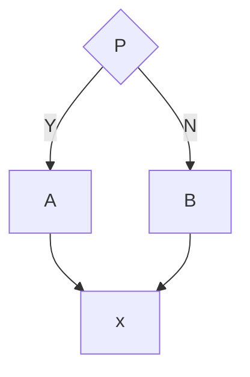
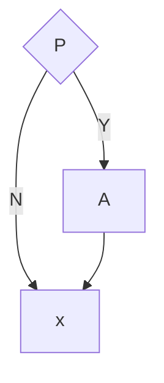
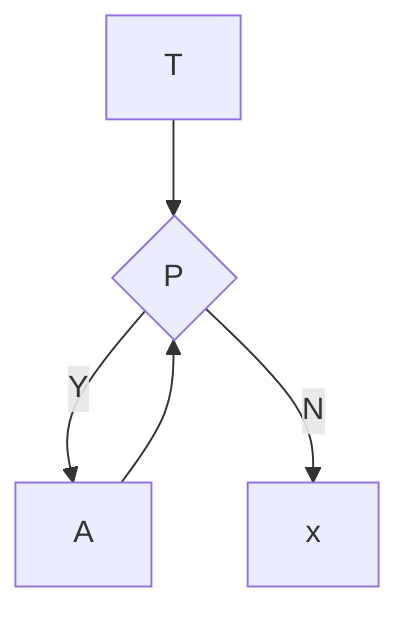
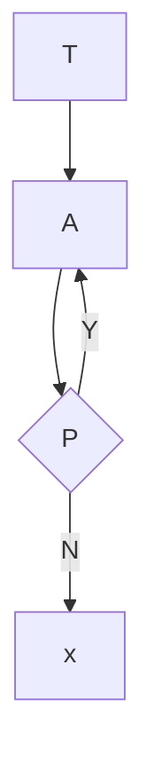

### 2026年8月29日

```c++
child_height = (dad_height + mom_height) * 0.54;
```
提示“Narrowing conversion from 'double' to 'float'”
问题：0.54 是 double 类型，计算结果是 double，赋值给 float 会丢失精度。
改进方案：使用 0.54f 表示 float 常量
```c++
child_height = (dad_height + mom_height) * 0.54f;
```

浮点数输出保留n位小数用“%.nf”表示

### 2026年8月30日

C语言中的关键字
```c++
auto      double  int        struct
break     else    long       switch
case      enum    register   typedef
char      extern  union      return
const     float   short      unsigned
continue  for     signed     void
default   goto    sizeof     volatile
do        while   static     if
```

#### 所有函数都要记得加“return”！！！

顺序结构

选择结构1

选择结构2

当型循环结构

直到型循环结构


### 2026年8月31日
由于字符型变量在内存中存储的是字符的ASCII码，即一个无符号整数，其形式与整数的存储形式一样，因此C语言允许<span style="background:green">字符型数据和整型数据之间相互转换</span>

|   类型    |          关键字          | 字节 |                      数值范围                      |
|:-------:|:---------------------:|:--:|:----------------------------------------------:|
|   整型    |     \[signed] int     | 4  |             -2147483648~2147483647             |
|  无符号整型  |    unsigned \[int]    | 4  |                  0~4294967295                  |
|   短整型   |     short \[int]      | 2  |                  -32768~32767                  |
| 无符号短整型  | unsigned short \[int] | 2  |                    0~65535                     |
|   长整型   |      long \[int]      | 4  |             -2147483648~2147483647             |
| 无符号长整型  | unsigned long \[int]  | 4  |                  0~4294967295                  |
|   字符型   |    \[signed] char     | 1  |                    -128~127                    |
| 无符号字符型  |     unsigned char     | 1  |                     0~255                      |
|  单精度型   |         float         | 4  |   -3.4×10<sup>-38</sup>~3.4×10<sup>38</sup>    |
|  双精度型   |        double         | 8  |  -1.7×10<sup>-308</sup>~1.7×10<sup>308</sup>   |
|  长双精度型  |      long double      | 10 | -1.2×10<sup>-4932</sup>~1.2×10<sup>4932</sup>  |
