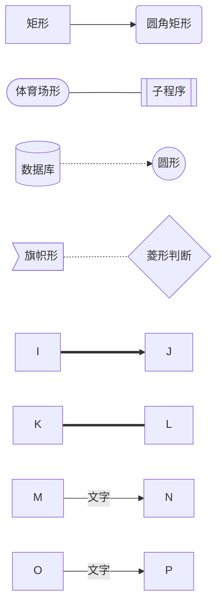
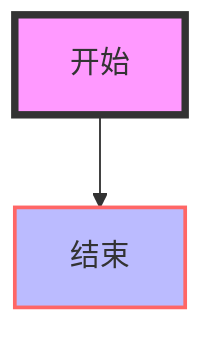
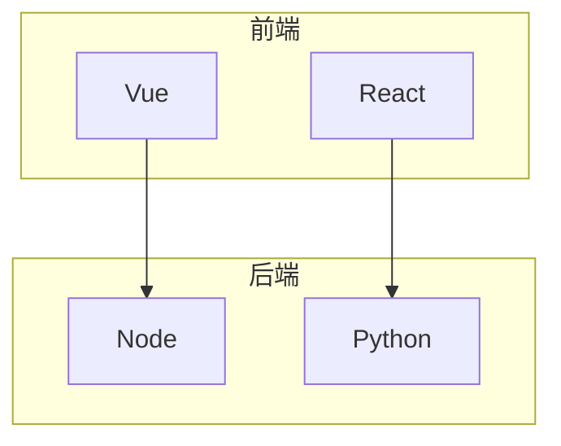
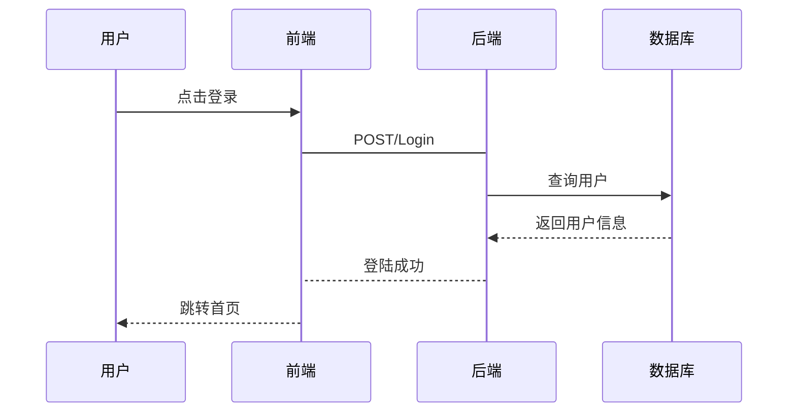
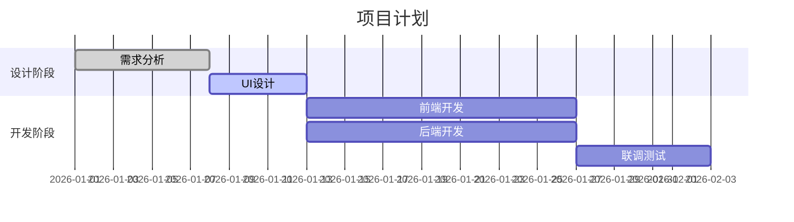
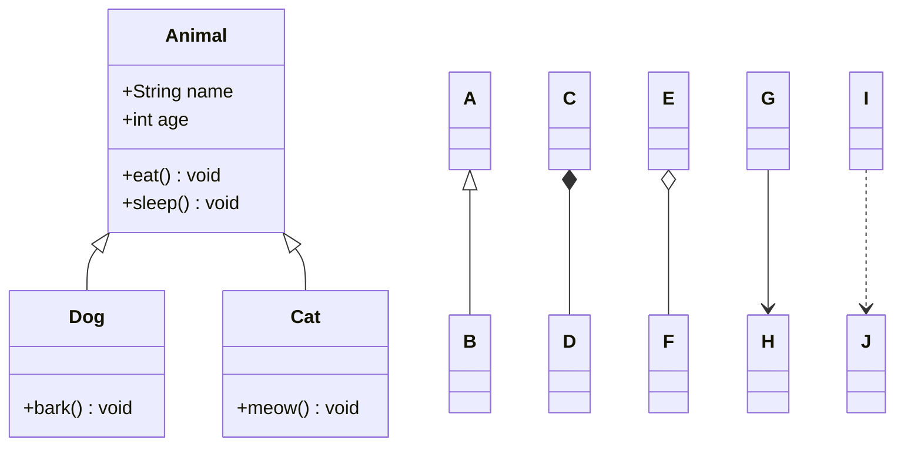
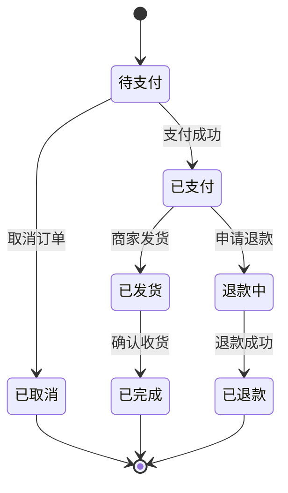
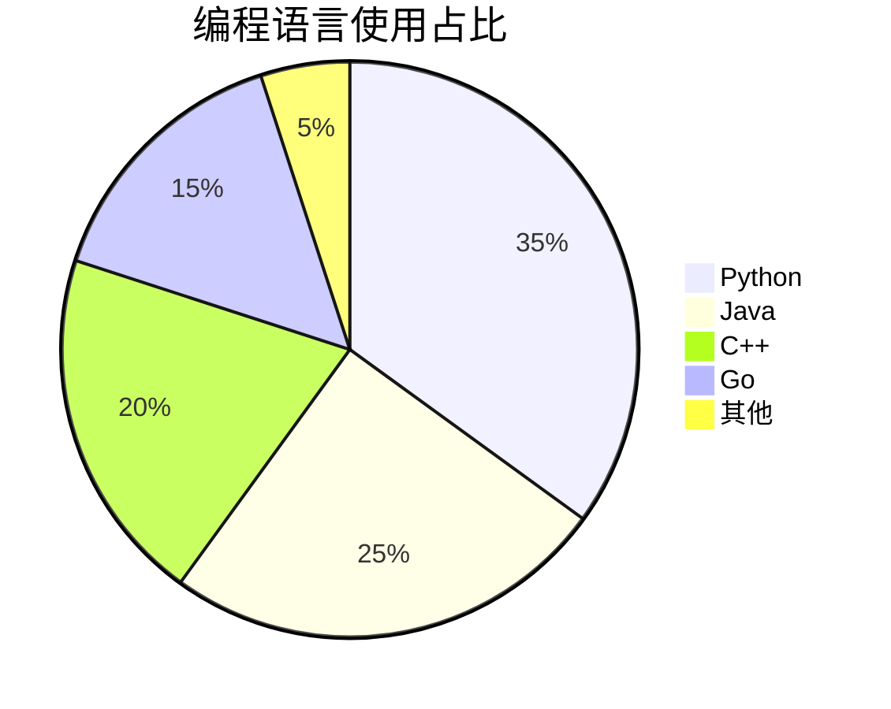
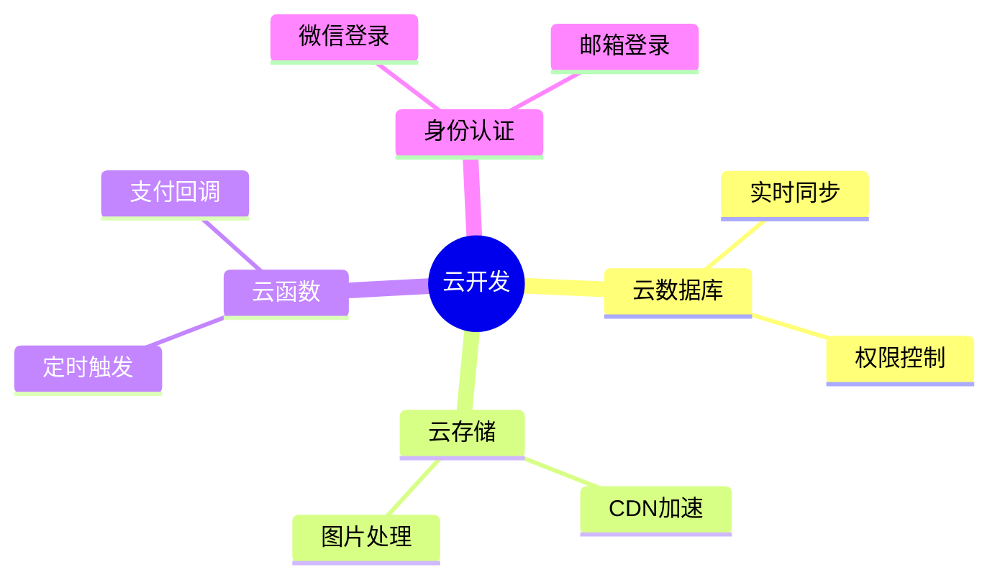

## 流程图

```mermaid
graph LR
    A[矩形]
    B(圆角矩形)
    C([体育场形])
    D[[子程序]]
    E[(数据库)]
    F((圆形))
    G>旗帜形]
    H{菱形判断}
    A --> B
    C --- D
    E -.-> F
    G -.- H
    I ==> J
    K === L
    M --文字--> N
    O -->|文字| P
```

### 样式设置

```mermaid
graph TB
    A[开始] --> B[结束] 
    
    style A fill:#f9f,stroke:#333,stroke-width:4px
    style B fill:#bbf,stroke:#f66,stroke-width:2px

    classDef important fill:#f96,stroke:#333;
    class A important
```

### 子图

```mermaid
graph TB
    subgraph 前端
        A[Vue]
        B[React]
    end
    
    subgraph 后端 
        C[Node]
        D[Python]
    end
    
    A --> C
    B --> D
```

## 时序图

```mermaid
sequenceDiagram
    participant 用户
    participant 前端
    participant 后端
    participant 数据库
    
    用户->>前端: 点击登录
    前端->后端: POST/Login
    后端->>数据库: 查询用户
    数据库-->>后端: 返回用户信息
    后端-->前端: 登陆成功
    前端-->>用户: 跳转首页
```

## 甘特图

```mermaid
gantt
    title 项目计划
    dateFormat YYYY-MM-DD
    
    section 设计阶段
        需求分析 :done, a1, 2026-01-01, 7d
        UI设计 :active, a2, after a1, 5d
    
    section 开发阶段
        前端开发 :b1, after a2, 14d
        后端开发 :b2, after a2, 14d
        联调测试 :c1, after b1, 7d
```

## 类图

```mermaid
classDiagram 
    class Animal {
        +String name
        +int age
        +eat() void
        +sleep() void
    }
    
    class Dog {
        +bark()void
    }
    
    class Cat {
        +meow() void
    }
    
    Animal <|-- Dog
    Animal <|-- Cat
    
    class A { }
    class B { }
    class C { }
    class D { }
    class E { }
    class F { }
    class G { }
    class H { }
    class I { }
    class J { }
    
    %%继承
    A <|-- B
    %%组合
    C *-- D
    %%聚合
    E o-- F
    %%关联
    G --> H
    %%依赖
    I ..> J
```

## 状态图

```mermaid
stateDiagram-v2
    [*] --> 待支付
    待支付 --> 已支付:支付成功
    待支付 --> 已取消:取消订单
    已支付 --> 已发货:商家发货
    已发货 --> 已完成:确认收货
    已支付 --> 退款中:申请退款
    退款中 --> 已退款:退款成功
    已取消 --> [*]
    已完成 --> [*]
    已退款 --> [*]
```

## 饼图

```mermaid
pie title 编程语言使用占比
    "Python" : 35
    "Java" : 25
    "C++" : 20
    "Go" : 15
    "其他" : 5
```

## 思维导图

```mermaid
mindmap
    root((云开发))
        云数据库
            实时同步
            权限控制
        云存储
            CDN加速
            图片处理
        云函数
            定时触发
            支付回调
        身份认证
            微信登录
            邮箱登录
```